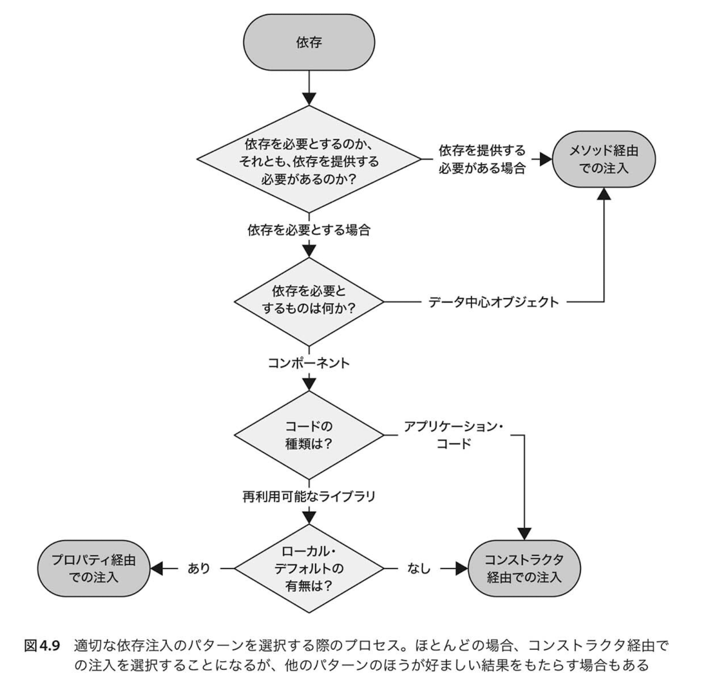

# 依存注入に関する設計パターン

* 合成基点(Composition Root): アプリケーションで必要となる様々なオブジェクト・グラフをどのように構築を示すかのパターン
* コンストラクタ経由での注入(Constructor Injection): クラスに対してそのクラスが必要とする依存を静的に宣言するパターン
* メソッド経由での注入(Method Injection): 処理を行うたびに必要となる依存、もしくは依存を利用するオブジェクトが変わる場合であっても、適切な依存を提供できるようにするパターン
* プロパティ経由での注入(Property Injection): 対象のクラスのオブジェクトにデフォルトの振る舞いを持つ依存(ローカル・デフォルト)が既に保持されている場合、その依存を別の依存に置き換えることでデフォルトの振る舞いを必要に応じて上書きできるようにするパターン。

特に重要なのは「合成基点」と「コンストラクタでの注入」の2つ

## 合成基点(Composition Root)

合成基点(Composition Root)とは様々なモジュールが合成されるアプリケーションの単一の論理的な場所のこと。

コンストラクタ経由の注入などをする際、必ず大元のコードではオブジェクトを生成して注入する必要がある。オブジェクトを生成するときは**アプリケーションのエントリーポイントに限りなく近い場所**でまとめて生成するようにする。

* **DIコンテナを使う場合、そのDIコンテナを使う唯一の場所が合成基点となる。**
* 合成基点は同一モジュールであれば、Mainメソッドの一部でも複数クラスにまたがっても良い。
* 合成基点はサービスとそのサービスを利用するコードを結びつけたものであり、アプリケーションのビジネスロジックとは関係のないコード。
* 合成基点がUI層と同じアセンブリ内にある場合も、合成基点がUI層の一部になることはない。


例
```csharp

public static class Program
{
    public static void Main(string] args)
    {
        string connectionString = args[0];
        HomeController controller = CreateController(connectionString); 
        var result = controller.Index();
        var vm = (FeaturedProductsViewModel)result.Model;
        
        Console. WriteLine("Featured products:");

        foreach (var product in vm. Products)
        {
            Console. WriteLine(product.SummaryText);
        }

    }

    private static HomeController CreateController(string connectionString)
    {
        var userContext = new ConsoleUserContext();

        // オブジェクトグラフの構築
        return new HomeController(
            new ProductService(
                new SqlProductRepository(new CommerceContext(connectionString)),
                userContext
            )
        );
    }
}
```

合成起点では以下の4つのことしか行わない。
* 構成情報の取得
    * ※構成ファイルを用意しなくてもテストしやすいように、構成情報の取得とオブジェクト合成のメソッドは分ける。
* オブジェクト・グラフの構築
* 目的機能の呼び出し
* オブジェクト・グラフの解放

## コンストラクタ経由での注入(Constructor Injection)


* 依存を必要とするクラスは`public`なコンストラクタ引数から必要な依存を受け取れるようにすることでどのような依存を必要としているかを提示できる。
* クラスの外からアクセスできるコンストラクタは1つにしないといけない
* 複数の依存が必要なら、すべての依存を受け取れるようなコンストラクタにしないとだめ


UI層のコントローラーにドメイン層のサービスをコンストラクタ経由で注入する例
```cs
public class HomeController
{
    private readonly IProductService service;

    public HomeController(IProductService service)
    {
        if (service == null) throw new ArgumentNullExceotion("service");

        this.service = service;
    }
}
```


### どんなときにコンストラクタ注入にする？
依存注入を考えるとき、デフォルトはコンストラクタ経由での注入で考えるべき。
なぜなら、コンストラクタ経由での注入がもっとも頻繁に遭遇するシナリオに対処できるから。

そのシナリオとは、必要とする依存が1つ以上あるが適切なローカルデフォルトを入手できない、というもの。


#### ローカルデフォルト
同じモジュールや同じ層にある依存の実装クラスのこと。その実装にはデフォルトの振る舞いが定義されている。
(要は、`interface`を実装したクラス)


### コンストラクタ注入のメリット、デメリット
#### メリット
* 依存が注入されることが保証される
* 実装が簡単
* 依存を利用するクラスが必要とする依存を静的に宣言できる。


#### デメリット
* 制約に縛られた生成(Constrained Construction)というアンチパターンを適用するフレームワークによって、コンストラクタ注入がやりにくくなる場合がある


## メソッド経由での注入(Method Injection)

メソッドを呼び出すたびに必要な依存が変わる場合(振る舞いが変わる)や、その依存を利用するオブジェクトが呼び出すたびに変わる場合は、依存をメソッドの引数で渡すという選択肢がある。


メソッド経由での注入例(`IUserContext`を毎回渡している。)
```cs
public decimal CalculateDiscountPrice(decimaI price, IUserContext context)
{
    if (context == null) throw new ArgumentNullException("context");

    var discount = context.IsInRole(Role.PreferredCustomer) ? .95m : 1;

    return price * discount;
}
```

### メソッド注入のメリット、デメリット
#### メリット
* メソッドの呼び出し元は呼び出しごとに異なる依存を提供できるようになる。
* 合成基点で作られていない、データ中心オブジェクト(data-centric-object)に依存を注入できるようになる。

#### デメリット
* 適用性に限界がある。
* 依存が、その依存を利用するクラスの抽象が公開するAPIの一部となってしまう。


### 依存が注入されるオブジェクトがメソッドを呼び出すたびに変わる場合
(※依存を利用するクラスとかがエンティティとかで毎回変わる場合)

エンティティが持つメソッドがそれぞれ個別の依存しか使わないとき、コンストラクタ注入だと、エンティティのロジックテストをするときにどちらの依存も注入しないといけないので、テストが重くなる。
メソッド注入にすることでテストもやりやすくなる。

```cs
public class Customer
{
    public Guid Id { get; private set; }
    public string Name { get; private set; }

    public Customer(Guid id, string name)
    {
        // 略
    }

    public void RedeemVouchar(Vouchar vouchar, IVoucharRedemptionService service)
    {
        if (vouchar == null) throw new ArgumentNullException("vouchar");
        if (service == null) throw new ArgumentNullException("service");

        service.ApplyRedmptionForCustomer(vouchar, this.Id)
    }

    public void MakePreferred(IEventHandler handler)
    {
        if (handler == null) throw new ArgumentNullException("handler");

        handler.Publish(new CustomerMadePreferred(this.Id));
    }

}
```


```cs

public class CustomerServices : ICustomerServices
{
    private readonly ICustomerRepository repository;
    private readonly IVoucherRedemptionService service;

    public CustomerServices(ICustomerRepository repository, IVoucherRedemptionService service)
    {
        this.repository = repository;
        this.service = service;
    }

    public void RedeemVoucher(Guid customerId, Voucher voucher)
    {
        var customer = this.repository.GetById(customerId);

        // 依存が注入されるオブジェクトがメソッドを呼び出すたびに変わる
        customer.RedeemVoucher(voucher, this.service);

        this.repository.Save(customer);
    }
}

```


## プロパティ経由での注入 (Property Injection)

ローカル・デフォルトとなるプロパティを公開し、そのプロパティをSetter経由で置き換えられるようにすることで、デフォルトとは異なる振る舞いをする依存を注入する方法。


以下のようにプロパティで依存を持ち、他の振る舞いに置き換えられるようになっている。
```cs
public class Customer
{
    public IDependency Dependency { get; set; }

    public void DoSomething()
    {
        this.Dependency.Echo();
    }
}
```


### メリット
* 理解しやすい

### デメリット
* 堅牢な実装にしにくい。
    * 他のコードで元の依存を置き換えられてしまったりする可能性あるから
* 適用する場面が限られる。
* 再利用可能なライブラリでしか使えない
* **一時的結合**を引き起こす。
    * ↑の例で言うと、`Dosomething()`を動かすには、正しく`Dependency`プロパティを初期化していないといけないから。(利用者側が使い方を理解していないと問題が起こる。)

### どのようなときにプロパティ注入を使うのか
* 通常時はローカル・デフォルトを使うようになっている一方、別の依存に置き換えて振る舞いに変えたいとき。
* **依存の注入が任意であるとき**
    * 必ず注入が必要なら、コンストラクタ経由の注入を選択すべき。
* 「コンストラクタの過度な注入」を解決するためにプロパティ注入を使うのはおかしいのでやめる。
    * そのクラスが単一責任の原則に違反してたりするだけ。


## どのパターンを選択すべきか
本に記載されていた選択のプロセス。



> *引用: Steven van Deursen 「なぜ依存を注入するのか DIの原理・原則とパターン」 p.150*

