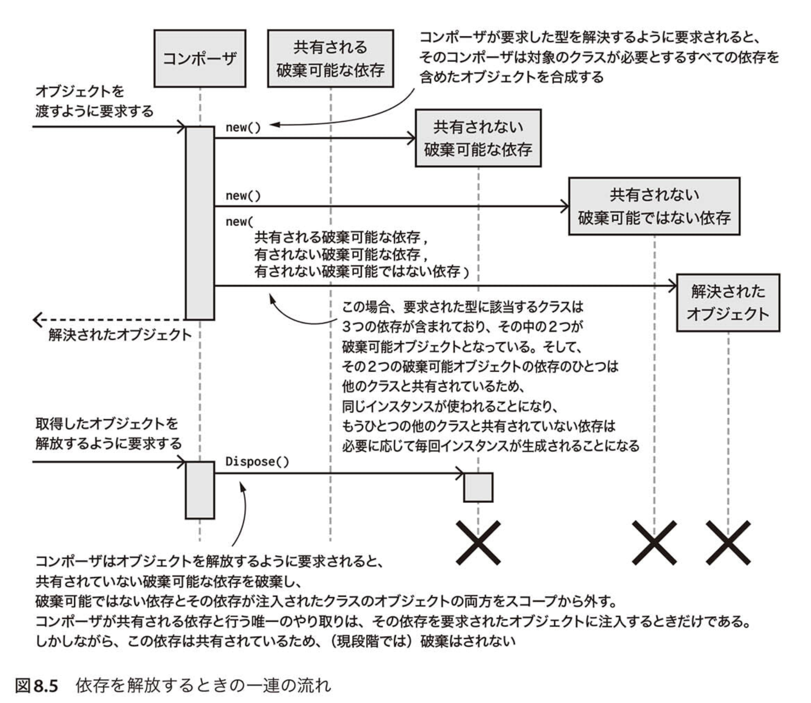

# オブジェクトの生存期間(lifetime)


* 破棄可能な抽象は漏洩する抽象になる
    * 短命な破棄可能オブジェクトを利用するクラスにそのまま注入すると、生存管理を利用する側が行わなくてはいけないので、注入してはいけない。
    ファクトリを注入して、生存管理をファクトリで行うようにする。
    * ※できるならそもそも破棄可能な抽象にすべきではない。


* 依存の解放(release)と依存の破棄(dispose)は同じじゃない。
    * 解放(release): どの依存を参照から外し、場合によっては破棄することができるのか、もしくはどの依存を生存させたままにするのか、ということを決定するプロセスのことである。その解放されたオブジェクトを破棄するのか、再利用するのかを決定する責務はコンポーザーが担う。



> *引用: Steven van Deursen 「なぜ依存を注入するのか DIの原理・原則とパターン」 p.308*


## 主な生存戦略(lifestyle)

|  名前 | 概要 | 
| ----- | ---- | 
|シングルトン生存戦略 (Singleton Lifestyle)|1つのインスタンスが何度も利用される| 
|   短命な生存戦略 (Transient Lifestyle)    |新しいインスタンスが常に提供される| 
|スコープ指定生存戦略 (Scoped Lifestyle)|暗黙的、もしくは明示的に定義されたスコープごとに各型のインスタンスが最大1つ提供される。|

※この他にも破棄可能なオブジェクトもある


## シングルトン生存戦略(Singleton Lifestyle)
1つのコンポーザの中に対象の型のインスタンスが1つしか存在せず、<br>
シングルトン生存戦略を適用したオブジェクトを取得しようとしたら、コンポーザーから毎回同じインスタンスが取得されるようにすること。


Singletonパターンとは似て非なるもの。どちらも依存のインスタンスを1つだけ存在させるという点が同じ一方、Singletonパターンはどこからでもオブジェクトをアクセスできるようにしているのに対して、**シングルトン生存戦略はstaticなメソッドやプロパティを介してアクセスできないような仕組みにしている。**


### シングルトン生存戦略を適用するケース
* 状態を持たないStatelessなサービス
    * 不変オブジェクトなど
### シングルトン生存戦略を適用しないほうがいいケース

* 生成するオブジェクトがスレッド・セーフではない場合
    * 仕組み上、同じオブジェクトをいろんなクラスから使うため、同時にアクセスされても問題ないオブジェクトじゃないといけない。
* 生成するオブジェクトの依存の中に短命であることが望まれるものが含まれるとき
    * 

## 短命な生存戦略 (transient Lifestyle)
**短命な生存戦略を適用したオブジェクトは、コンポーザが毎回生成して返すようになる。**

これを適用したオブジェクトが`IDisposable`を実装している場合、
コンポーザはそのオブジェクトを監視し、<br>
そのオブジェクトが含まれているオブジェクト・グラフが解放するように要求されたら、そのオブジェクトを明示的に破棄するようにしないといけない。

※`IDisposable`を実装してなかったら関係ない。

### 短命な生存戦略を適用するケース

* 注入する依存がスレッド・セーフなのかどうかわからないときは、その依存に対しては短命な生存戦略を適用するほうが安全。
    * 短命な生存戦略が3つの中で一番安全なので
* 


## スコープ指定生存戦略 (scoped Lifestyle)

**対象のスコープ内では同じインスタンスをコンポーザが返す**ようにするやつ。<br>


### スコープ指定生存戦略を適用ケース
* 長い間稼働するアプリケーションの中で、ある程度、隔離された状況で処理をすることが求められるとき
    * Webアプリケーションなど、複数のリクエストを並列処理するが、1つのリクエスト内で状態を管理することが多いので、この戦略を適用して1リクエスト内では同じインスタンスが返すようにしたほうがいい。(DbContextなどスレッド・セーフじゃなくて、1リクエストに1個だけあればいいから適している。)


## 生存戦略(lifestyle)を間違った選択

間違った使い方をするとバグを持ち込むことになる

### 捕らわれた依存 (Captive Dependency)

想定以上に依存を生存させてしまうこと。


捕らわれた依存の例
```cs
public class Composer
{
    // SqlProductRepositoryはシングルトン生存戦略を適用する。
    private readonly IProductRepository repository;

    public Composer(string connectionString)
    {
        // SqlProductRepositoryはスレッド・セーフでシングルトンである一方、
        // CommerceContextはスレッド・セーフではないとき、この短命な生存戦略は解放したくても
        // SqlProductRepository中に入ったままになるので、捕らわれた依存となる。(同じくシングルトン生存戦略になる)
        this.repository = new SqlProductRepository(new CommerceContext(connectionString)
        );
    }
}
```

ただ、純粋な注入はやらないと思うし、今使っているSimpleInjectorというDIコンテナはこれをやるとエラーになるようだった。
