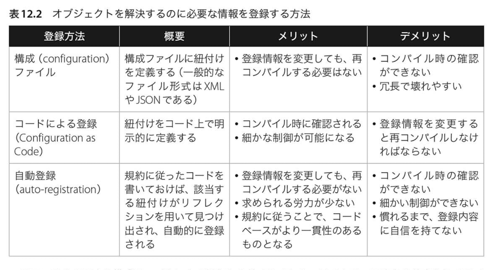
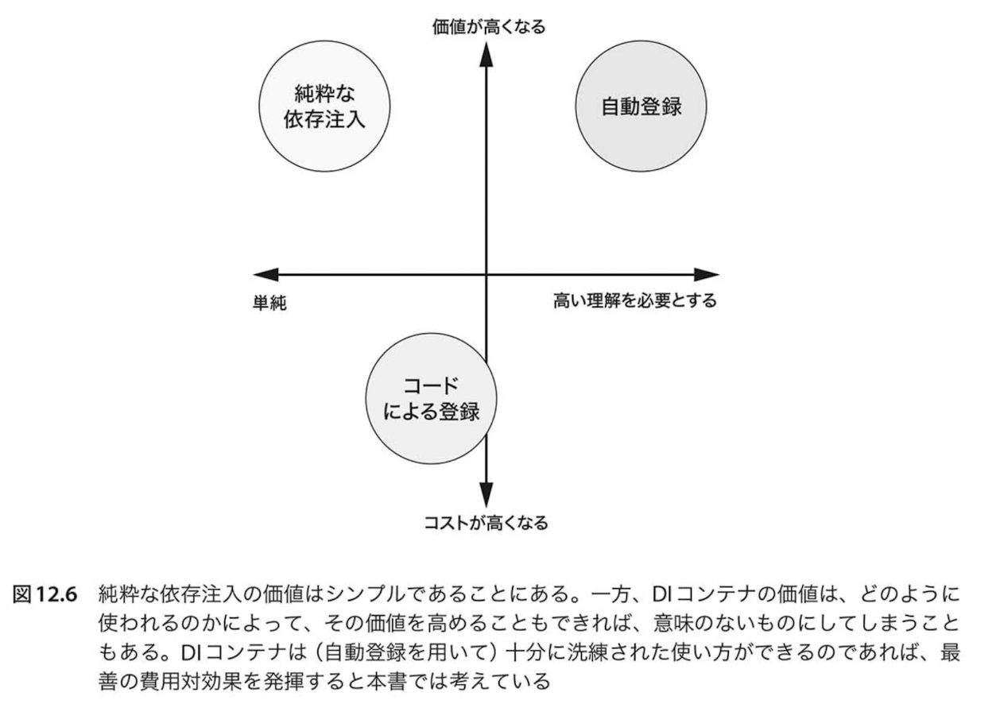

# DIコンテナ

DIコンテナは、今まで学んできた、オブジェクト合成(object composition)、介入(interception)、生存管理(lifetime management)などの様々なタスクを自動化してくれるソフトウェア・ライブラリのこと。

## DIコンテナの登録
* 構成ファイルによる登録
    * XMLとかjsonを使ってオブジェクトを登録する方法
* コードによる登録
    * 登録情報をソースコードに記述する方法
* 自動登録
    * DIコンテナがが指定されたアセンブリの中から規約に沿ったクラスを見つけ出し、そのクラスが実装した抽象とそのクラスの紐づけを自動で登録する機能

### 登録方法のメリット・デメリット

> *引用: Steven van Deursen 「なぜ依存を注入するのか DIの原理・原則とパターン」 p.459*

## どの登録方法を使うか

自動登録 > コードによる登録 > 構成ファイルによる登録

* 自動登録は紐づけが追加されても合成基点を更新しなくて済むから
* 遅延バインディングを必要としない限り、構成ファイルよりコードの登録にする。

## どんなときにDIコンテナ使うか
DIコンテナを使うと便利になる一方、新しいライブラリの学習コストとなるし、純粋な依存注入と比べてコンパイラによる型の確認もできないので純粋な依存注入とDIコンテナはトレード・オフの関係にある。

> *引用: Steven van Deursen 「なぜ依存を注入するのか DIの原理・原則とパターン」 p.479*

